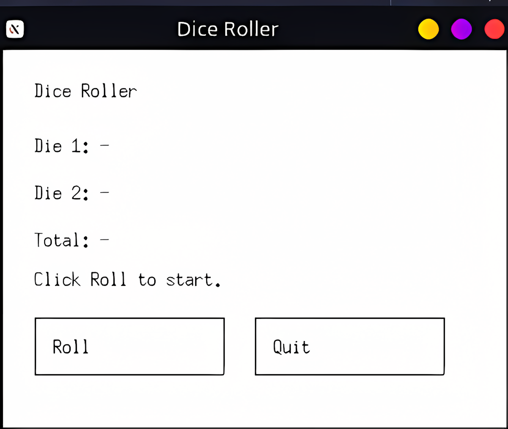
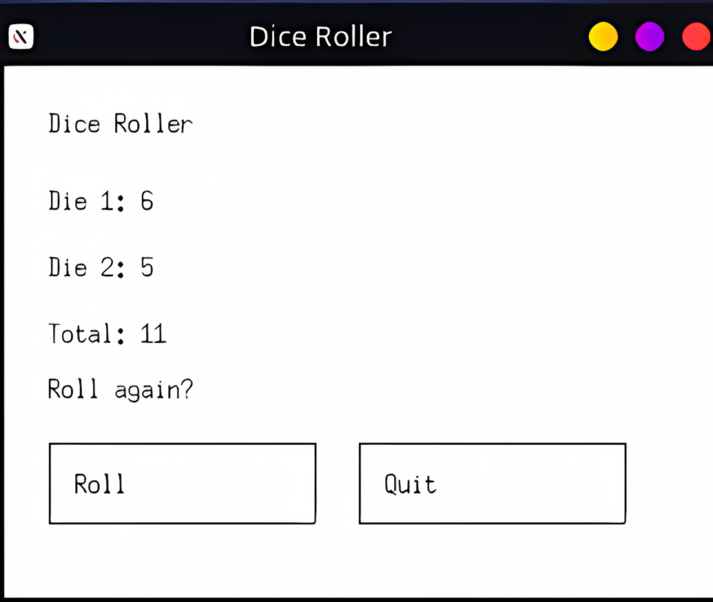
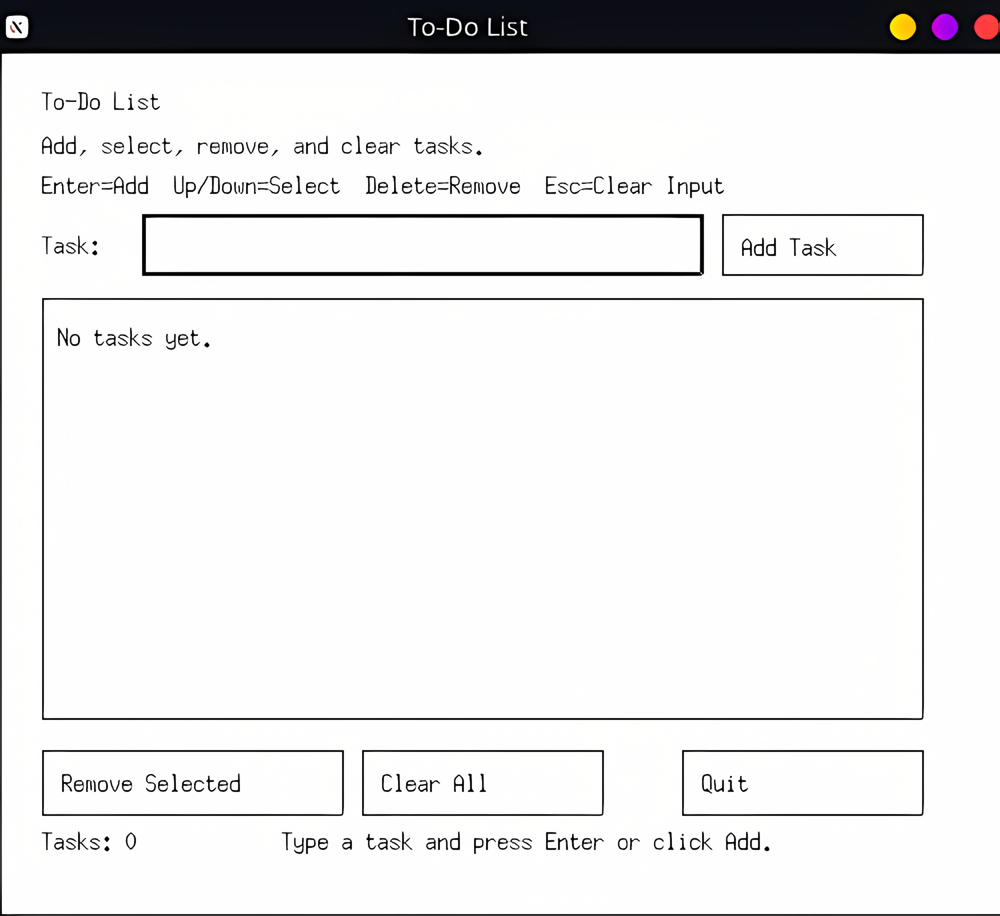
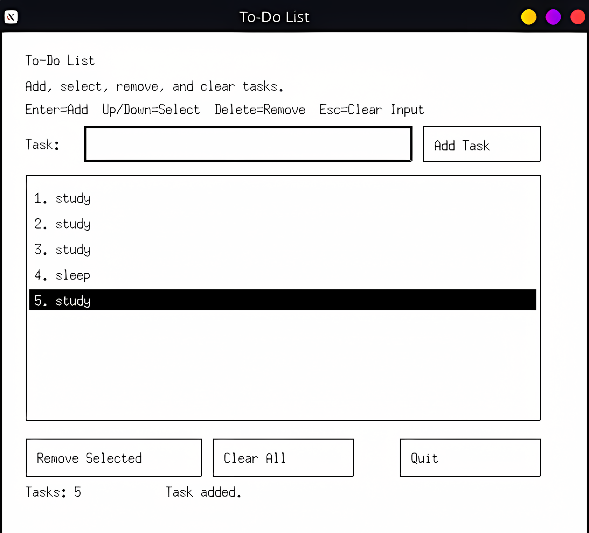
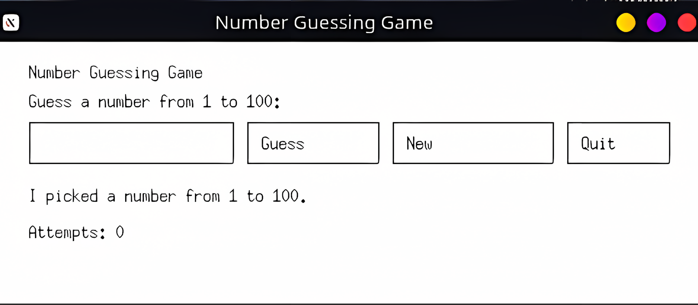
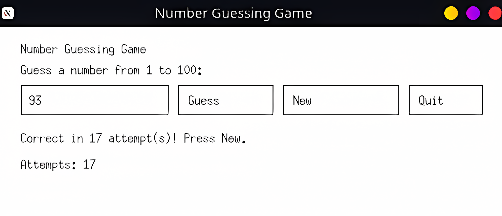
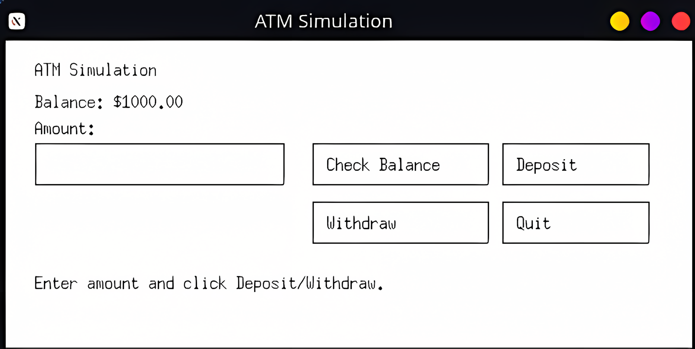
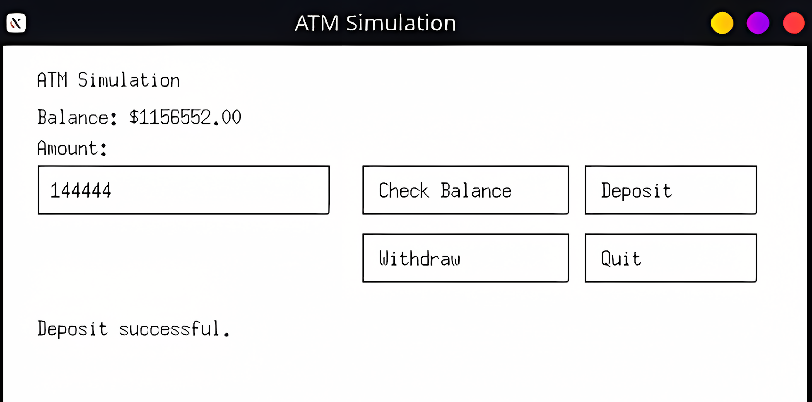

# ARCH Internship - Month 1

This repository contains four C++ practice projects:

1. **`dice.cpp`** (Project 1): A cross-platform GUI dice roller app (Win32 GUI on Windows, X11 GUI on Linux).
2. **`todo.cpp`** (Project 2): A cross-platform GUI to-do list app (Win32 GUI on Windows, X11 GUI on Linux).
3. **`number_guess.cpp`** (Project 3): A cross-platform GUI number guessing game (Win32 GUI on Windows, X11 GUI on Linux).
4. **`atm_simulation.cpp`** (Project 4): A cross-platform GUI ATM simulation using OOP for balance, deposit, and withdrawal.

---

## Requirements

- `dice.cpp`, `todo.cpp`, `number_guess.cpp`, and `atm_simulation.cpp` build on both Windows and Linux with GUI behavior.
- A C++17 compiler.
- Linux GUI builds require X11 development libraries (`libX11`).

---

## Build

### Using MSVC (`cl`) on Windows

```powershell
cl /EHsc dice.cpp user32.lib gdi32.lib
cl /EHsc todo.cpp user32.lib gdi32.lib
cl /EHsc number_guess.cpp user32.lib gdi32.lib
cl /EHsc atm_simulation.cpp user32.lib gdi32.lib
```

### Using MinGW g++ (Windows)

```powershell
g++ -std=c++17 dice.cpp -o dice.exe -lgdi32 -luser32
g++ -std=c++17 todo.cpp -o todo.exe -lgdi32 -luser32
g++ -std=c++17 number_guess.cpp -o number_guess.exe -lgdi32 -luser32
g++ -std=c++17 atm_simulation.cpp -o atm_simulation.exe -lgdi32 -luser32
```

### Using g++ on Linux

```bash
g++ -std=c++17 dice.cpp -o dice -lX11
g++ -std=c++17 todo.cpp -o todo -lX11
g++ -std=c++17 number_guess.cpp -o number_guess -lX11
g++ -std=c++17 atm_simulation.cpp -o atm_simulation -lX11
```

---

## Run

### Windows

```powershell
.\dice.exe
.\todo.exe
.\number_guess.exe
.\atm_simulation.exe
```

### Linux

```bash
./dice
./todo
./number_guess
./atm_simulation
```

---

## Screenshots

A `screenshots/` folder is included with stage images for all four projects.

### Project 1 - Dice Roller




### Project 2 - To-Do List




### Project 3 - Number Guessing Game




### Project 4 - ATM Simulation



