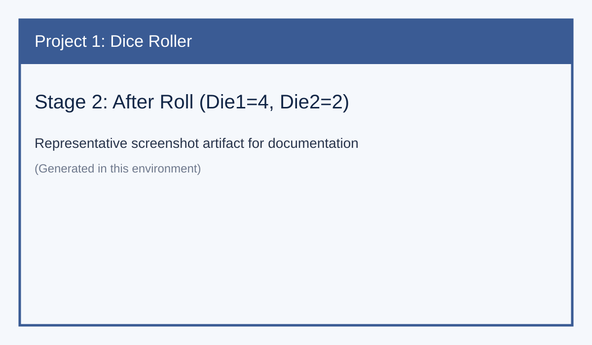
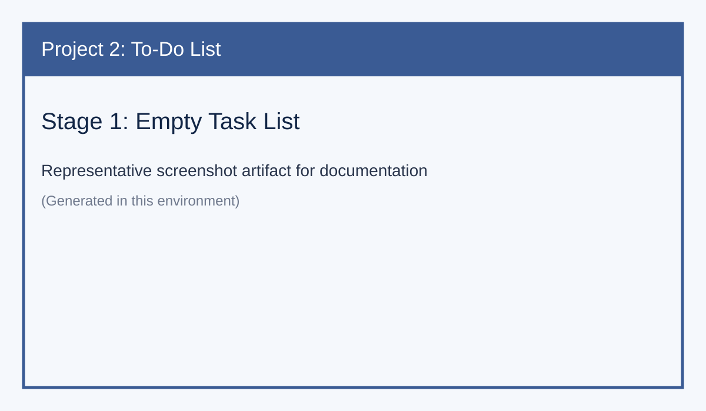
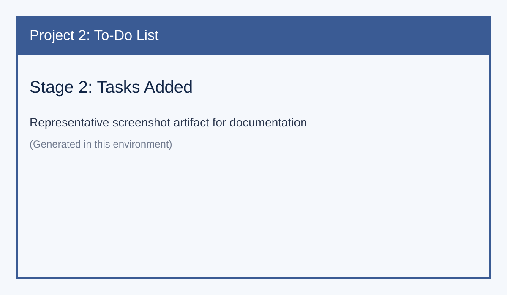
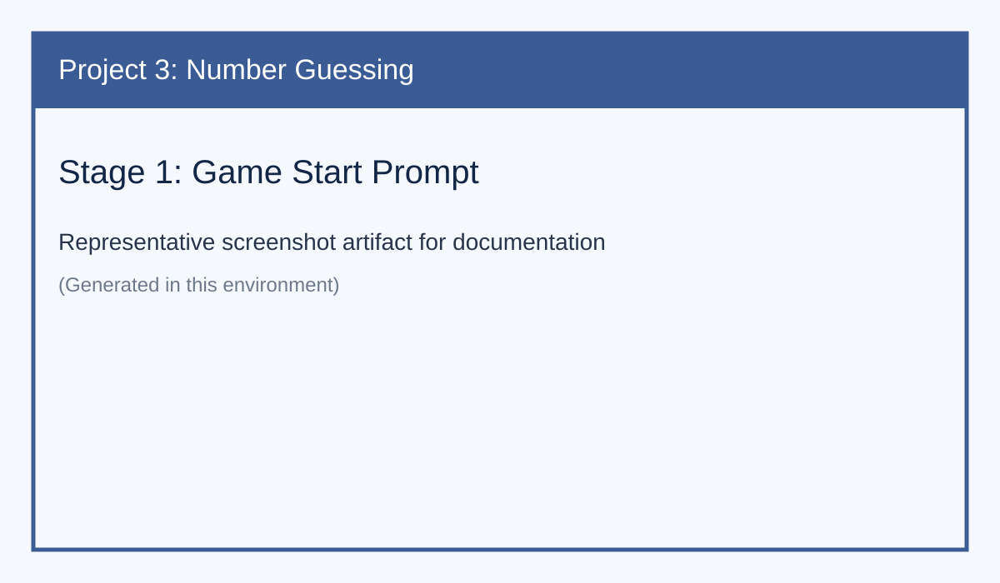
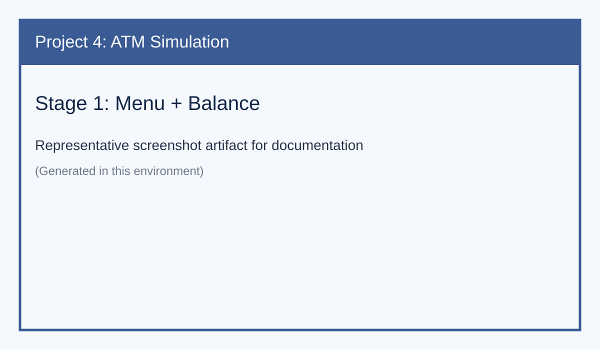
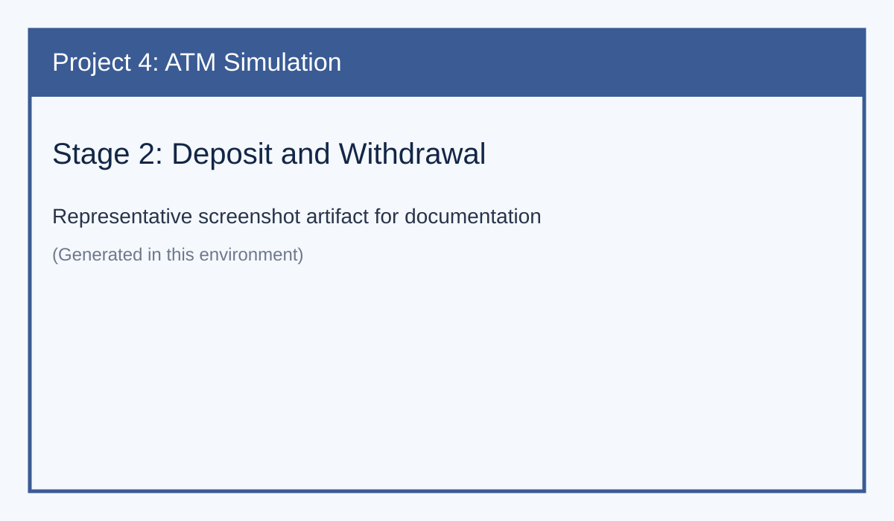

# ARCH Internship - Month 1

This repository now contains four C++ practice projects:

1. **`dice.cpp`** (Project 1): A cross-platform dice roller app. It uses a Win32 GUI on Windows and a console menu on Linux/macOS.
2. **`todo.cpp`** (Project 2): A cross-platform to-do list app. It uses a Win32 GUI on Windows and a console menu on Linux/macOS.
3. **`number_guess.cpp`** (Project 3): A console number guessing game between 1 and 100 with high/low hints.
4. **`atm_simulation.cpp`** (Project 4): A console ATM simulation using OOP for balance, deposit, and withdrawal.

---

## Requirements

- `dice.cpp` builds on both Windows and Linux/macOS (GUI on Windows, console elsewhere)
- `todo.cpp` builds on both Windows and Linux/macOS (GUI on Windows, console elsewhere)
- A C++ compiler with Win32 support for GUI apps
  - Visual C++ (`cl`) from Visual Studio Developer Command Prompt, or
  - MinGW g++
- Any C++17-compatible compiler for console apps (`number_guess.cpp`, `atm_simulation.cpp`)

---

## Build

### Using MSVC (`cl`)

```powershell
cl /EHsc dice.cpp user32.lib gdi32.lib
cl /EHsc todo.cpp user32.lib gdi32.lib
cl /EHsc number_guess.cpp
cl /EHsc atm_simulation.cpp
```

### Using MinGW g++ (Windows)

```powershell
g++ -std=c++17 dice.cpp -o dice.exe -municode -lgdi32 -luser32
g++ -std=c++17 todo.cpp -o todo.exe -municode -lgdi32 -luser32
g++ -std=c++17 number_guess.cpp -o number_guess.exe
g++ -std=c++17 atm_simulation.cpp -o atm_simulation.exe
```

### Using g++ on Linux/macOS

```bash
g++ -std=c++17 dice.cpp -o dice
g++ -std=c++17 todo.cpp -o todo
g++ -std=c++17 number_guess.cpp -o number_guess
g++ -std=c++17 atm_simulation.cpp -o atm_simulation
```

---

## Run

### Windows

```powershell
.\dice.exe
.\todo.exe
.\number_guess.exe
.\atm_simulation.exe
```

### Linux/macOS

```bash
./dice
./todo
./number_guess
./atm_simulation
```

---

## Screenshots

A `screenshots/` folder is included with stage images for all four projects.

### Project 1 - Dice Roller




### Project 2 - To-Do List




### Project 3 - Number Guessing Game




### Project 4 - ATM Simulation



